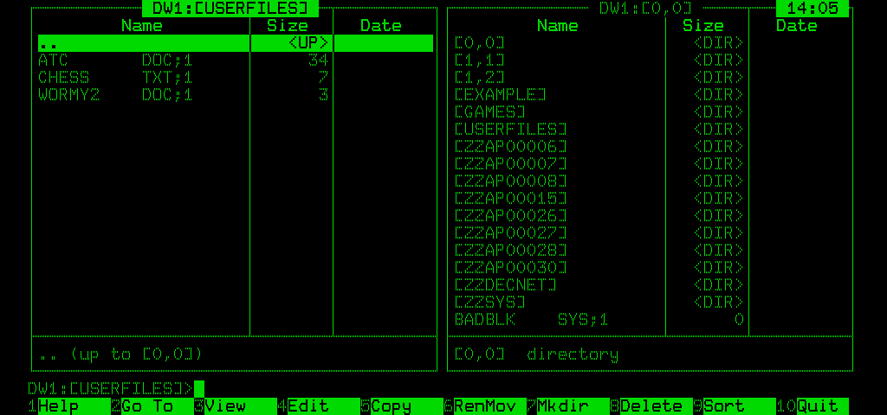

<div align="center">

# NC for P/OS

**A Norton Commander style file manager for the
DEC Professional 350/380 workstation**

P/OS V3.2 &nbsp;·&nbsp; PDP-11 (F-11 / J-11) &nbsp;·&nbsp; LK201 keyboard
&nbsp;·&nbsp; Files-11 &nbsp;·&nbsp; Oregon Software Pascal-2 &nbsp;·&nbsp; MACRO-11

```
+--------------------------------------------------------------------+
|  d i g i t a l      PROFESSIONAL 350/380            P/OS V3.2      |
+--------------------------------------------------------------------+
```



</div>

NC is a two-panel file manager in the style of Norton Commander for the
DEC Professional 350/380 under P/OS V3.2.

The sources are Oregon Software Pascal-2 (`nc.pas`) and MACRO-11
(`ncio.mac`). Pascal-2 is not available on P/OS, so the task is built on
RSX-11M-PLUS and the image copied to the Pro, where it runs unmodified.

NC has been tested only under the Xhomer emulator, not on real
Professional hardware.

Run it from the DCL prompt of Command Language or PRO/Tool Kit:

    $ RUN NC

Either application must be active, since NC relies on the PIP and EDT
tasks they install.


## Keys

The Pro terminal handles F1-F5 (Hold Screen, Print Screen, Set-Up, F4,
Break) itself and does not pass them to programs, so NC uses Help and
F17-F20 in their place. The on-screen legend uses PC numbering. With
Xhomer's `fkey_map = pc` (the default), each PC key sends the Pro key
shown:

    PC key      Pro key       NC            PC key   Pro key       NC
    F1, Menu    Help          Help          F6       Interrupt     Rename/Move
    F2          F17           Device/dir    F7       Resume        Mkdir
    F3          F18           View          F8       Cancel        Delete
    F4          F19           Edit (EDT)    F9       Main Screen   Sort
    F5          F20           Copy          F10      Exit          Quit
    Esc, F11    F11 (ESC)     Cancel        F12      BS            Backspace

Shift+F1 to Shift+F5 send Hold Screen, Print Screen, Set-Up, F4 and
Break, and Shift+F12 sends LF.

Xhomer maps the PC editing keypad to the LK201's by position, not by
name:

    PC key                    Pro key       NC
    Insert, Pause, Scroll Lock,
      Right Alt               Do            Return
    Home                      Insert Here   Select file (also ^T)
    Page Up                   Remove        (unused)
    Delete                    Select        Last entry
    End                       Prev Screen   Page up (also Left)
    Page Down                 Next Screen   Page down (also Right)
    (none)                    Find          First entry

ESC followed by a digit also selects a function: ESC 1 is F1, ESC 0 is
F10.

## Commands

P/OS has no MCR, and DCL does not accept commands from another task.
NC translates common DCL verbs into commands for MMV and PIP, the tasks
DCL itself uses:

| In NC | Runs as |
|---|---|
| Return on a .TSK, `RUN x` | `MMV INSTALL/RUN x` |
| F7 Mkdir | `MMV CREATE/DIR dev:[x]` |
| Change of active panel | `MMV SET DEFAULT dev:[dir]` |
| `SET`, `SHOW DEFAULT`, `SHOW LOGICALS`, `ASSIGN`, `DEASSIGN`, `DISMOUNT`, `INSTALL`, `REMOVE`, `CREATE/DIRECTORY`, `DELETE/DIRECTORY`, `BAD` | `MMV` + command line |
| `MOUNT dev: label` | `MMV MOUNT dev:label` |
| `INITIALIZE dev: label` | `MMV BAD dev:`, then `MMV INITIALIZE dev:label` |
| `DIR`, `TYPE`, `COPY a b`, `RENAME a b`, `DELETE`, `PURGE` | PIP (`/LI`, `TI:=`, `b=a`, `b/RE=a`, `/DE`, `/PU`) |
| `PRINT spec` | `MMV PRINT spec` |
| Any other verb | Installed task `...xxx` (PIP, EDT, DMP, LBR, PMA, PAB, NFT, ...) |

Not supported: indirect command files (`@file`) and SHOW commands other
than DEFAULT and LOGICALS, which need DCL itself. Return on a .CMD file
opens it in the viewer.

The default directory follows the active panel and is restored on exit.

## Task size

The task must fit in 32K words and leave free space for the Pascal-2 runtime
at start-up. NC is compiled with `/NOWALKBACK/NOCHECK`, which saves
about 4K words.


## Building

The build runs from Linux against an RSX-11M-PLUS host, using helper
scripts in `~/DEC`:

| Script | Purpose |
|---|---|
| `rsxd.py` | Holds a logged-in session on the RSX terminal line (192.168.10.151:10001) |
| `rsx.py` | Runs commands through that session |
| `rsxput.py` | Uploads a text file via `PIP file=TI:` |
| `rsxget.py` | Downloads a file via `DMP /HX` |

    ./build.sh                          # upload, @NCMAKE, fetch NC.TSK
    ../posdeploy.sh posnc/NC.TSK        # transfer to the Pro (run from ~/DEC)

Sources are built in `DB0:[NCPOS]`. `NCBLD.CMD` sets `UNITS=16`;
`ncio.mac` uses LUNs 13-15.

`posdeploy.sh` requires the Pro at a DCL `$` prompt. It starts Kermit-11
RECEIVE on the Pro and sends the file with `ksend.py` over the comm-port
bridge. Task images are sent as contiguous files; P/OS rejects a
non-contiguous image with "File is not a task image". Other files are
sent as text.
